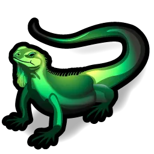

# Iguana — MilkDrop-Style Audio Visualizer
`It really licks the eyeball... yeah.`



Godot 4 skinnable & customizable audio-reactive shader visualizer with a feedback rendering pipeline. Analyzes audio in real time, extracts frequency, transient, and mood uniforms, and feeds them into a feedback loop that accumulates visual history across frames — the core technique behind MilkDrop.

**Language:** GDScript / GDShader  
**Renderer:** Forward+  
**Target Godot:** 4.6+

---

## Architecture

```
AudioEffectSpectrumAnalyzer
		↓
AudioAnalyzer.process()          — runs every frame via AudioSource
		↓
_push_uniforms()                 — 30+ values pushed to the active ShaderMaterial
		↓
FeedbackViewport (SubViewport)   — shader renders here (ColorRect + ShaderMaterial)
		↓
BackbufferViewport (SubViewport) — copies FeedbackViewport output each frame
		↓
prev_frame uniform               — shader reads last frame from BackbufferViewport
		↓
PostProcessDisplay (ColorRect)   — tonemap / gamma / vignette / grain on top
```

**Two-viewport design:** a shader cannot sample its own render target. `FeedbackViewport` renders the current frame; `BackbufferViewport` (rendered second) copies it. Next frame, `prev_frame` is `BackbufferViewport.get_texture()` — the completed previous frame, never the live target.

**Post-process layer:** `post_process.gdshader` sits above the SubViewportContainer and reads the raw feedback texture. Tonemap, gamma, vignette, and grain are applied *outside* the feedback loop so they do not compound or trail.

---

## Project Structure

```
├── engine/
│   ├── audio_analyzer.gd      # Full audio analysis pipeline (FFT → uniforms)
│   ├── audio_source.gd        # AudioStreamPlayer wrapper + crossfade logic
│   ├── keymap.gd              # Rebindable key action registry
│   └── visualizer.gd          # Shader switching, feedback buffer, uniform push
├── shaders/
│   ├── utils/
│   │   ├── post_process.gdshader  # External tonemap/gamma/grain/vignette layer
│   │   └── shader_template.gdshader  # Starter template for new shaders
│   └── *.gdshader             # Visualizer shaders (auto-discovered at runtime)
├── ui/
│   ├── main/                  # GDScript UI files
│   │   ├── player_ui.gd
│   │   ├── settings_ui.gd
│   │   ├── playlist.gd
│   │   ├── playlist_ui.gd
│   │   ├── styles_ui.gd
│   │   ├── notification_ui.gd
│   │   ├── ui_theme.gd
│   │   └── ui_style.gd
│   └── appearance/            # Swappable skins
│       ├── aero/              # Aero Blue skin
│       │   ├── theme.tres     # Color scheme
│       │   ├── style.tres     # Glass shader params + animation
│       │   ├── style.gdshader # UI overlay shader
│       │   └── icons/         # SVG icon set
│       ├── iguana/            # Iguana Green skin
│       └── kitty/            # Kitty skin
├── docs/
│   ├── APPEARANCE.md          # Theme / Style / Icon pack authoring
│   ├── SHADER.md              # Writing and adding visualizer shaders
│   └── MILKDROP.md            # How to achieve the MilkDrop feel in Iguana
├── config.gd                  # Persistent settings (ConfigFile, user://)
├── main.tscn
└── project.godot
```

Shaders are discovered automatically by scanning `res://shaders/` at startup. Any `.gdshader` file with valid `@meta` tags is loaded. See [docs/SHADER.md](docs/SHADER.md) for how to add one.

The appearance system uses self-contained skin folders — each with its own theme, style, and icon pack. Skins are swappable at runtime without restart. Individual components can also be mixed and matched. See [docs/APPEARANCE.md](docs/APPEARANCE.md) for how to author custom skins.

---

## License

AGPL-v3 License.
